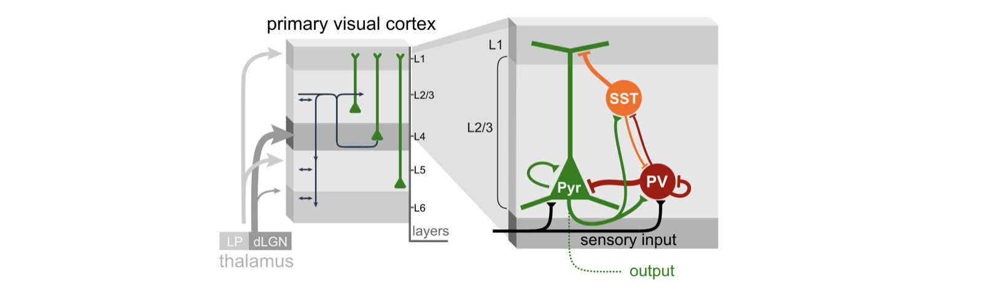
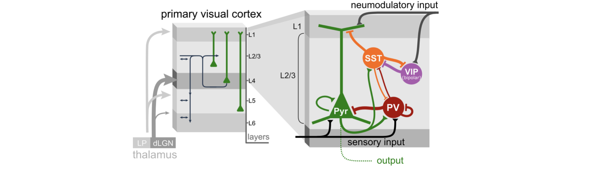

# Modelling Neuromodulation in Cortical Circuits

## Setup

### 1. Install a `python` distribution

Download and install the miniforge installer:
see https://github.com/conda-forge/miniforge

### 2. Install the scientific computing packages

```
pip install numpy scipy scikit-learn matplotlib 
```

### 3. Install `brian2` 

```
pip install brian2
```

### 4. Clone this repository

```
git clone https://github.com/yzerlaut/neuromod-2026
```

## Project

> *Modelling the VIP-mediated Effedt of Arousal Modulation on Cortical Dynamics and Computation*


### Tasks

### 1. Implement another afferent excitatory drive targetting pyramidal and VIP interneurons

i.e. starting from this arcitecture:



Implement this architecture with the additional neuromodulatory drive:




### 2. Study the effect on neural dynamics of the modulatory drive

Compute the firing rates of all populations before and after the onset of a neuromodulatory drive.

### 3. Study the effect on network computation of the modulatory drive 

Compute, before and after onset of neuromodulation:

- the mean evoked response following stimulus presentation
- the decoding accuracy for different stimuli